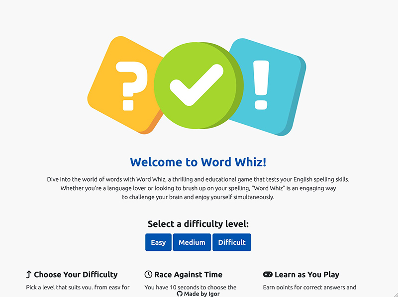

# Word Whiz

## Table of Contents
1. [Introduction](#introduction)
2. [Features](#features)
3. [Technology](#technology)
4. [How to Play](#how-to-play)
5. [Installation](#installation)
6. [Learning Outcomes](#learning-outcomes)
7. [User Story](#user-story)
   - [Overview](#overview)
   - [User Story Breakdown](#user-story-breakdown)
   - [User Satisfaction Goals](#user-satisfaction-goals)
8. [User Flow](#user-flow)
9. [Task Flow for Playing a Game](#task-flow-for-playing-a-game)
10. [Testing](#testing)
   - [Prerequisites for Testing](#prerequisites-for-testing)
   - [How to Test](#how-to-test)
   - [Automated Testing](#automated-testing)
   - [Reporting Issues](#reporting-issues)
11. [Functionalities](#functionalities)
12. [Wireframes](#wireframes)
13. [Usability Testing Report](#usability-testing-report)
   - [Overview](#overview-1)
   - [Participants](#participants)
   - [Findings and Observations](#findings-and-observations)
   - [Conclusions](#conclusions)
   - [Recommendations](#recommendations)
14. [Validations](#validations)
15. [Deployment](#deployment)
16. [Credits](#credits)
17. [Contact](#contact)
18. [Contributing](#contributing)


## Introduction

**Word Whiz** is an engaging and educational web-based game designed to test and improve English spelling skills. Players can choose different difficulty levels - easy, medium, and difficult - and race against the clock to select the correct spelling of words. This game is a perfect blend of learning and fun, suitable for language enthusiasts and those looking to enhance their spelling proficiency.
Live webpage [here](https://igordinuzzi.github.io/Word-Whiz/)

## Features
- **Homepage

- **Multiple Difficulty Levels**: Choose from easy, medium, or difficult levels to match your skill level.

- **Timed Challenges**: Each question must be answered within 10 seconds, making the game fast-paced and exciting.

- **Scoring System**: Earn points for each correct answer and track your progress.

- **Instant Feedback**: Receive immediate feedback on your answers, allowing effective learning.


- **Responsive Design**: The game is designed to be responsive and can be played on various devices.

- **Favicon


## Technology
- HTML/CSS for structure and styling
- Bootstrap for responsive design
- JavaScript for interactive elements and game logic

## How to Play
1. **Start the Game**: Open the game in a web browser and select a difficulty level (easy, medium, difficult).
2. **Answer Questions**: Each screen will present a word with two spelling options. Click the button with the correct spelling.
3. **Beat the Clock**: You have 10 seconds to choose an answer.
4. **Track Your Score**: Your score updates in real-time with each correct answer.
5. **Play Again**: After finishing a round, you can play again or exit the game.

## Installation
1. Clone the repository:
   ```bash
   git clone https://github.com/[your-username]/word-whiz.git
   ```
2. Navigate to the cloned directory.
3. Open `index.html` in a web browser to start playing.

## Learning Outcomes

From a student's perspective, this project was instrumental in understanding and applying:

- Web Development Fundamentals: Gaining hands-on experience with HTML, CSS, and JavaScript.
- Responsive Design: Learning how to create a responsive interface using Bootstrap that adapts to different screen sizes.
- Game Logic Implementation: Developing skills in JavaScript to manage game mechanics and user interactions.
- Version Control: Using Git and GitHub for source code management and deployment.- User-Centered Design: Focusing on user experience and usability throughout the development process.
- Testing and Debugging: Conducting thorough testing and learning to troubleshoot and resolve issues efficiently.
- Creative Problem Solving: Overcoming challenges in game development and interface design.
- Project Management: Planning, developing, and completing a project within a set timeframe.

## User Story

### Overview
As a user interested in improving my English spelling skills, I want to play a game that challenges me in a fun and interactive way, enabling me to learn while enjoying the game.

### User Story Breakdown

- **As a user, I want to...**
  - **Choose a difficulty level (easy, medium, difficult)**
    - **Acceptance Criteria**:
      - The game offers three distinct levels of difficulty.
      - I can easily select the desired level from the main menu.
      - Each level provides appropriately challenging words.
  - **Be able to play a timed spelling challenge**
    - **Acceptance Criteria**:
      - Each question has a 10-second timer.
      - The game displays a countdown and notifies me when time runs out.
  - **Receive immediate feedback on my answers**
    - **Acceptance Criteria**:
      - The game shows whether my answer is correct or incorrect right after I select an option.
      - For incorrect answers, the correct spelling is displayed.
  - **See my ongoing score as I play**
    - **Acceptance Criteria**:
      - The score is visible and updated immediately after each question.
      - The score calculation is clear and consistent.
  - **Have a responsive and user-friendly interface**
    - **Acceptance Criteria**:
      - The game's interface is clean and easy to navigate.
      - The game works well on different devices and screen sizes.
  - **Restart the game or change levels without restarting the browser**
    - **Acceptance Criteria**:
      - There are options to restart the game or go back to the main menu after each round.
      - I can change difficulty levels without needing to refresh the page or restart the browser.
  - **Learn from my mistakes and improve my spelling**
    - **Acceptance Criteria**:
      - The game provides educational value by pointing out mistakes and correct spellings.
      - There is a variety of words that help me learn and improve my spelling.

### User Satisfaction Goals
- The game should be engaging and educational, providing a challenging yet rewarding experience.
- The interface should be intuitive, allowing for easy navigation and a focus on the gameplay.
- The game should offer a sense of progression and achievement as the user improves their spelling skills.

## User Flow

1. **Landing on the Homepage**
   - User arrives on the main page.
   - Sees the welcoming message and an image related to the quiz game.

2. **Reading Introduction**
   - Reads a brief introduction about the game, its purpose, and its educational value.

3. **Selecting Difficulty Level**
   - Encounters options to choose the difficulty level: Easy, Medium, or Difficult.
   - Selects a difficulty level to start the game.

4. **Game Interaction**
   - Presented with a series of spelling questions.
   - Chooses the correct spelling from two options.
   - Receives immediate feedback on their choice.
   - Views the score and remaining questions.

5. **Completing the Game**
   - After answering all questions, views the final score.
   - Presented with the option to play again or exit.

6. **Restarting or Exiting Game**
   - Chooses to either play again or exit the game.
   - If choosing to play again, selects a new difficulty level and starts over.

7. **Exploring Additional Information**
   - User may scroll down to view additional site information or external links (e.g., GitHub profile).

## Task Flow for Playing a Game

1. **Starting the Game**
   - User selects a difficulty level (Easy, Medium, or Difficult) on the main page.
   - The game screen loads with the first question.

2. **Answering Questions**
   - User reads the question and selects one of the two spelling options.
   - The game provides immediate feedback on the selection.
   - The score updates based on the response.
   - The game progresses to the next question until all questions are answered.

3. **Ending the Game**
   - Once all questions are answered, the game shows the final score.
   - User is given the option to play again or exit.

4. **Restarting or Exiting**
   - If 'Play Again' is selected, user returns to the difficulty selection screen.
   - If 'Exit' is selected, the game ends, and the user returns to the main screen.

### Additional Notes

- User interaction is centered around choosing correct spellings and receiving instant feedback.
- The game’s design encourages repeat play and offers a clear, straightforward path from game start to finish.
- The game flow is designed to be engaging and informative, encouraging learning through interaction.


## Testing

### Prerequisites for Testing
- Ensure you have a modern web browser like Chrome, Firefox, Safari, or Edge.
- JavaScript must be enabled in your browser.

### How to Test
1. **Load the Game**: Open `index.html` in your browser. Ensure the game loads without errors.
2. **Test Difficulty Levels**:
   - Select each difficulty level (easy, medium, difficult) and verify that questions and options correspond to the selected level.
3. **Check Responsiveness**:
   - Test the game on different devices (desktop, tablet, mobile) to ensure it scales properly.
   - You can adjust your browser window size and just observe if the layout changes accordingly.
4. **Gameplay Testing**:
   - Answer questions in each difficulty level and ensure the score updates correctly.
   - Test the timer functionality for each question.
   - Verify that the feedback for correct, incorrect, and timed-out answers is displayed as expected.
5. **Button Functionality**:
   - Ensure that the 'Play Again' and 'Exit Game' buttons work as intended.
   - Test that option buttons are selectable and show the correct or incorrect answer.
6. **Test Edge Cases**:
   - Try selecting an answer at the last second and verify that the game responds correctly.
   - Test the game behaviour if the browser window is refreshed or closed during gameplay.

### Automated Testing
If you wish to set up automated testing, you can use tools like Jest for JavaScript testing. This will require you to structure your game's code for testability and write test cases covering various scenarios.

### Reporting Issues
If you encounter any bugs or issues during testing, please report them on the [issues page](https://github.com/[igordinuzzi]/Word-Whiz/issues) with a detailed description of the problem and the steps to reproduce it.

## Functionalities

### Questions


### Check answers


## Wireframes

```css
:root {
    --primary-color: #0054AD;
    --secondary-color: #00678A;
    --background-color: #F8F9FA;
    --text-color: #343A40;
    --correct-answer-color: #28A745;
    --incorrect-answer-color: #DC3545;
    --neutral-accent: #6C757D;
    --tertiary-color: #ededed;
}
```


## Usability Testing Report

### Overview
Usability testing was conducted with five fictitious participants to evaluate the user experience, interface design, and overall functionality of the "Word Whiz" game. Each participant was given a set of tasks to complete while their interactions and feedback were recorded.

### Participants
1. **Alice (Age 25, Student)**: Familiar with online games but not specifically educational ones.
2. **Bob (Age 35, Teacher)**: Interested in educational tools and has moderate technical skills.
3. **Charlie (Age 20, College Student)**: Avid gamer with high technical skills, new to language-based games.
4. **Diana (Age 40, Writer)**: Keen interest in language and spelling, average computer skills.
5. **Ethan (Age 30, Software Engineer)**: High technical skills, occasionally playing online games.

### Tasks
- Start the game and select a difficulty level.
- Answer a series of spelling questions.
- Observe score updates and feedback for answers.
- Attempt to restart the game and change difficulty levels.
- Navigate through different screens of the game.

### Findings and Observations

1. **Alice**
   - Found the game interface intuitive and easy to navigate.
   - Suggested adding more engaging animations for correct/incorrect answers.
   - Experienced slight confusion when trying to restart the game.

2. **Bob**
   - Appreciated the educational value of the game.
   - Recommended adding a feature to track progress over time.
   I found the timer to be a bit stressful and suggested an untimed mode.

3. **Charlie**
   - Enjoyed the challenge but wanted more variety in the type of questions.
   - Experienced no technical issues.
   - Suggested adding a competitive element like a leaderboard.

4. **Diana**
   - Liked the clean layout but found the font size a bit small for her preference.
   - Reported a smooth and enjoyable experience.
   - Requested more advanced levels for users who master the difficult level.

5. **Ethan**
   - Pointed out that the game was responsive and functioned well on different devices.
   - Suggested adding keyboard shortcuts for power users.
   - Found the game to be entertaining and well-structured.

### Conclusions
- The game was well-received, with all participants finding it educational and engaging.
- Suggestions for improvements included adding progress tracking, more game modes, variety in questions, and additional features for advanced users.
- The interface was generally praised for its ease of use, though minor adjustments like font size could enhance the experience.
- Incorporating feedback such as animations, leaderboards, and keyboard shortcuts could further enrich the game.

### Recommendations
- Implement a progress tracking system for educational purposes.
- Consider adding different types of questions and an untimed mode.
- Improve accessibility options, such as adjustable font sizes.
- Explore adding advanced levels and competitive elements like leaderboards.
- Enhance user engagement with animations and keyboard shortcuts for quick navigation.

## Validations

### W3C Markup Validation Service


### Lighthouse report


### JS validator


## Deployment
Deployment to GitHub Pages:

The game was deployed to GitHub Pages, making it easily accessible to the public. The deployment process involved:

    In the GitHub repository, navigate to the ‘Settings’ tab.
    From the menu on the left, select 'Pages'.
    Under the 'Source' section, choose the 'main' branch and save.
    Once deployed, GitHub displays a green banner with a live link to the webpage.

## Credits

Game Development and Design: Igor Dinuzzi
Graphic Design and Assets: Created using various design tools and sourced from open libraries
Content: CHATGPT
Special Thanks: To everyone who played the game and provided valuable feedback
    

## Contact
Igor Dinuzzi - [https://github.com/igordinuzzi](https://github.com/igordinuzzi)

Project Link: [https://github.com/igordinuzzi/word-whiz](https://github.com/igordinuzzi/Word-Whiz)

## Contributing
Contributions, issues, and feature requests are welcome. Feel free to check [issues page](https://github.com/igordinuzzi/Word-Whiz/issues) if you want to contribute.

